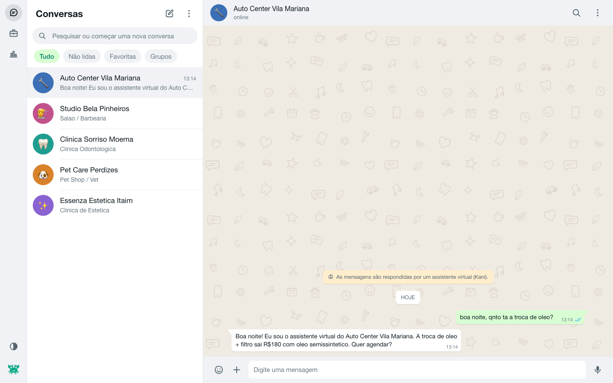
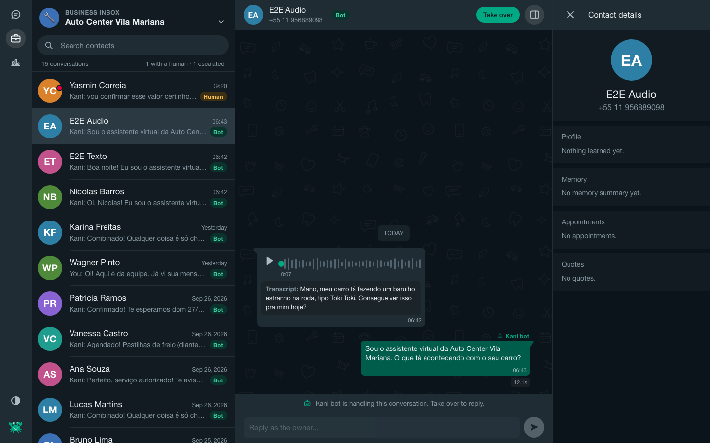
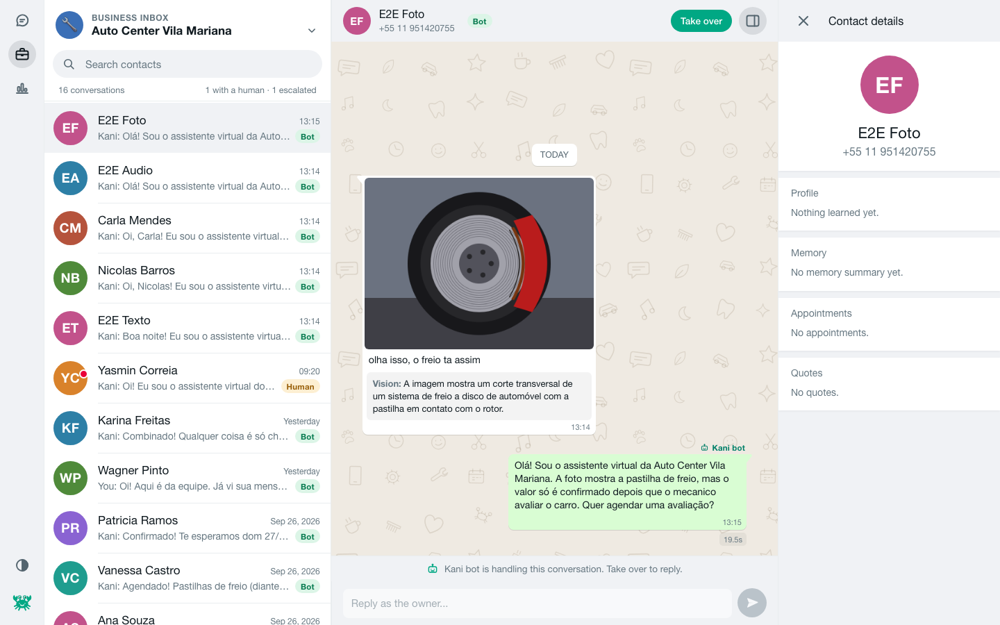
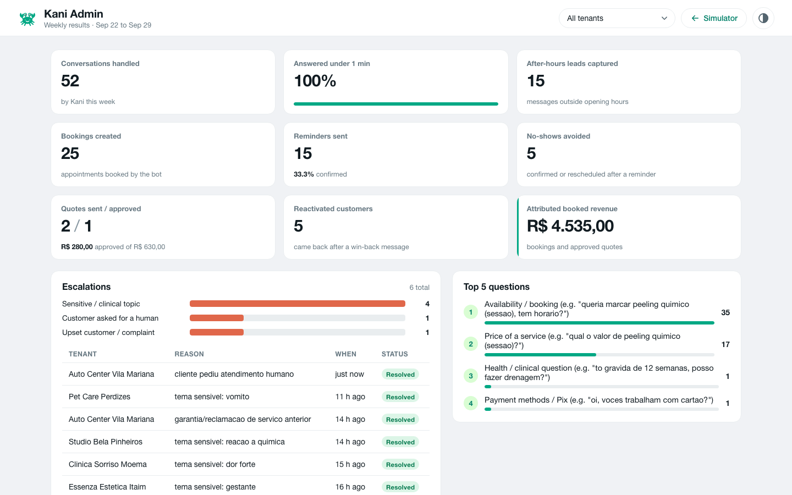

# Kani

Multi-tenant WhatsApp AI assistant for Brazilian small businesses (auto repair shops, salons and
barbershops, dental clinics, pet shops and vets, aesthetic clinics). This repository is a fully local
prototype: no API keys, no paid services, no cloud. The LLM runs in Ollama, voice notes are
transcribed with whisperX, and photos are described by a local vision model.

It serves three purposes:

1. **Sales demo**: a pixel-close WhatsApp Web style simulator where a shop owner can chat as a
   customer (text, voice note, photo), then flip to the Owner view to take over the conversation.
2. **Quality benchmark**: 75 scripted scenarios (5 packs x 15) played by a simulated customer,
   scored by deterministic checks plus an LLM judge, with HTML reports and a model A/B page.
3. **Production foundation**: typed schema with migrations, a `Channel` interface with a WhatsApp
   Cloud API stub, a deterministic policy layer around the model, and a clean module layout.

Customer-facing text is Brazilian Portuguese. Admin UI, code and reports are English.



| Owner view: voice transcript | Owner view: photo through vision | Admin |
| --- | --- | --- |
|  |  |  |

## Quick start

```bash
./start.sh
```

`start.sh` verifies and prepares everything, then opens http://localhost:3000:

| Step | What it does |
| --- | --- |
| Node | needs Node 22.18+ (built-in `node:sqlite` and TypeScript type stripping; tested on Node 26) |
| Ollama | uses the native app at `OLLAMA_URL` (starts `ollama serve` if needed) |
| Models | pulls `MODEL` (qwen3:8b) and `VISION_MODEL` (gemma3:12b) when missing |
| whisperX | uses `WHISPERX_BIN`, `.local/venv-whisper`, or `whisperx` on PATH; otherwise installs it into `.local/venv-whisper` with `uv` (plus a bundled ffmpeg) |
| npm | `npm ci` when `node_modules` is missing or stale |
| UI | builds `ui/dist` when sources changed |
| DB | applies migrations and seeds 5 Sao Paulo demo tenants plus one week of demo history |
| Launch | serves API + UI on one port and opens the browser |

Options: `./start.sh --reset` (wipe and reseed the local DB), `./start.sh --no-open`.
Everything Kani installs (Python venv, model caches, Playwright browsers) lives in `.local/`
inside the repo.

### What to try

- **Cliente** tab (left rail, chat icon): pick a business in the chat list (this is the tenant
  switcher) and ask things like `boa noite, qnto ta a troca de oleo?`, `quero agendar um corte
  amanha a tarde`, `posso pagar no pix?`. Record a voice note with the mic button or attach an
  audio file, or send a photo with the `+` button (the photo goes through gemma3:12b vision).
- **Owner** tab (briefcase icon): the business inbox. See transcripts of voice notes, vision
  descriptions of photos, tool calls under each bot reply, the escalation banner, and use
  **TAKE OVER** / **RESUME**. Mark appointments done (sends a Google review request) or no-show
  (sends a guilt-free rebooking message).
- **/admin** (chart icon): weekly owner metrics in English, links to scenario reports, and dev
  tools: time travel (+1h, +24h) makes reminders fire instantly.
- Try `esquecer meus dados` (LGPD erasure), `quero falar com um atendente` (handoff),
  `SAIR` (opt out of reminders), or reply `1` / `2` to a reminder.

## Commands

| Command | Purpose |
| --- | --- |
| `./start.sh` or `make start` | one-command startup |
| `make dev` | API with `--watch` plus Vite dev server on http://localhost:5173 |
| `make seed` | reset the local DB and reseed tenants and demo history |
| `make test` | unit and integration tests (`node:test`, scripted LLM double, no Ollama needed) |
| `make typecheck` | TypeScript 7 for server, UI and E2E |
| `make lint` | fails on any em-dash or en-dash in the repo (product copy rule) |
| `make run-scenarios` | all 75 scenarios for `MODEL`; e.g. `make run-scenarios MODEL=gemma3:12b` |
| `make run-scenarios ARGS="--packs oficina --ids s01,s07 --live-vision"` | subsets and live vision |
| `make run-scenarios-ab` | run `MODEL` and `ALT_MODEL`, then build the comparison page |
| `make compare` | rebuild the A/B page from the latest report per model |
| `make pull-alt` | `ollama pull` the alternative model |
| `make e2e` | Playwright E2E with real models; screenshots in `reports/screenshots/` |
| `make fixtures` | regenerate voice-note (macOS `say`) and image fixtures |

The scenario CLI also accepts `--model`, `--judge-model`, `--customer-model` and `--max-turns`:
`npm run scenarios -- --model gemma3:12b --judge-model qwen3:8b`.

## Configuration

Copy `.env.example` to `.env` (start.sh does this). Keys: `PORT`, `OLLAMA_URL`, `MODEL=qwen3:8b`,
`ALT_MODEL=gemma3:12b`, `VISION_MODEL=gemma3:12b`, `DB_PATH=data/kani.db`, `WHISPERX_BIN`,
`WHISPER_MODEL=small`, `LLM_TIMEOUT_MS=60000`, `SCHEDULER_TICK_MS=15000`.

## Architecture

```
src/
  engine/      prompt composer, LLM client (single generation queue, 60s timeout, tool loop max 4 rounds),
               tools, price guard, deterministic policies, templates, per-contact memory
  channels/    Channel interface, SimulatedChannel (drives the web UI), WhatsAppCloudChannel stub, SSE hub
  scheduler/   reminders (confirm_24h / confirm_2h), reactivation, idle memory summaries, time travel
  media/       whisperX CLI wrapper (voice notes), Ollama vision (photos)
  scenarios/   runner (customer simulator + judge), scorer, HTML reports, A/B comparison
  report/      weekly owner metrics
  server/      Fastify HTTP API, SSE, uploads, static UI/media/reports
  db/          SQLite connection, migration runner, typed repository (all SQL lives here)
  seed/        tenant seeding and deterministic demo history
  shared/      API contract types shared by server and UI
ui/            React + Vite: customer simulator, owner inbox, /admin
packs/         5 category packs (the spec's JSON, verbatim)
scenarios/     5 x 15 benchmark scenarios
seed/          tenants.json (one Sao Paulo demo tenant per pack)
migrations/    SQL migrations
tests/         node:test suites        e2e/  Playwright
fixtures/      voice notes and images  reports/  scenario reports, A/B page, screenshots
```

### Message flow

1. The channel delivers an inbound message (`SimulatedChannel.receive`, or a Cloud API webhook).
2. The engine stores it, marks it read, shows typing, and enriches media: whisperX transcript for
   audio, vision description injected as `[foto: <descricao>]` for images.
3. **Deterministic policies** run first: LGPD erasure, opt-out, explicit request for a human,
   spam, reminder answers (`1` confirms, `2` opens the reschedule flow), oficina quote approval
   (only on clear approval such as "aprovo" / "pode fazer", storing `approval_message_id`),
   sensitive-topic and angry-customer detection.
4. **Prompt**: the verbatim base prompt + pack + tenant (the only source of truth for prices,
   hours, services, Pix key) + tool guide + live context (date, calendar, contact profile,
   memory summary, appointments, open quotes, slots already offered) + last 12 messages.
5. **Tool loop** (max 4 rounds): `check_availability`, `book`, `reschedule`, `cancel`,
   `create_quote`, `schedule_reminder`, `escalate`, `log_lead`, all executed against the DB.
   qwen3:8b uses native tool calls; models without tool support (gemma3:12b) use a prompted
   JSON protocol parsed from text.
6. **Guard**: every reply is scanned for R$ amounts and price-like numerals. Any value not backed
   by the tenant's `services_json` replaces the reply with "vou confirmar esse valor certinho e já
   te retorno", escalates, and logs `guard_violation`. Odonto replies drop price sentences unless
   the customer asked about price. Claims of "agendado/cancelado" without the matching tool are
   repaired into a confirmation question. Em-dashes are stripped.
7. **Handoff**: escalations, sensitive topics, angry customers, explicit human requests and two
   consecutive low-confidence turns pause the bot for that conversation (status `human`). The
   owner's TAKE OVER pauses it too; RESUME re-enables it.

All model calls (bot, customer simulator, judge, vision, memory) go through one in-process FIFO
queue, so Ollama never receives two generations at once.

### Data model

`tenants`, `contacts`, `conversations`, `messages`, `appointments`, `quotes`, `reminders`,
`escalations`, `events` exactly as specified, plus a few operational columns (contact
`profile_json`, conversation `low_conf_streak` / `disclosed` / `pending_note`, message `status`
and `meta_json`, appointment `ends_at` / `price` / `source`). See `migrations/0001_init.sql`.

### Why SQLite (and the production path)

Docker is not installed on the target Mac, and one-command startup matters, so the prototype uses
the SQLite engine built into Node (`node:sqlite`): nothing to install or compile, WAL mode,
deterministic tests with in-memory databases. The schema is plain SQL in numbered migrations and
all queries live in `src/db/repo.ts`. For production, point a Postgres implementation of the same
`Repo` methods at the same migrations (swap `json_extract` for `->>` and `AUTOINCREMENT` for
`bigserial`). More decisions in [DECISIONS.md](DECISIONS.md).

### WhatsApp Cloud API path

`src/channels/whatsapp-cloud.ts` implements the same `Channel` contract as the simulator (the
contract test suite runs against both) and records the Graph API calls it would make. Its header
lists the production TODOs: Embedded Signup per tenant, webhook verification and
`X-Hub-Signature-256`, media download by id, 24h customer-service-window tracking with a template
sender for out-of-window reminders, and coexistence notes (20 msg/s cap, chat backups disabled,
owner phone echoes as `owner` messages).

## Benchmark

`make run-scenarios` plays every scenario in `scenarios/*.json` against the real engine:

- The customer is played by the same local model with the spec prompt ("Voce e {persona}.
  Objetivo: {title}. Escreva como paulistano no WhatsApp...").
- Audio scenarios go through the transcription path with a scripted transcript (marked simulated
  audio). Image scenarios inject `[foto: <image_description>]`; `--live-vision` routes the
  bundled fixture image through gemma3:12b instead.
- Each scenario runs against a fresh, frozen clock (a Tuesday 10:00 in Sao Paulo, or the
  scenario's `clock`), in its own database under `reports/tmp/`.
- The judge returns strict JSON (Ollama structured output). Deterministic checks computed in code
  floor or override it: invented prices force grounding to 0, a missing DB booking forces action
  correctness to 0, a verified booking or escalation guarantees a minimum, guard triggers and
  repaired action claims cap grounding.
- Rubric: factual grounding 0-3 (x2), action correctness 0-3 (x2), escalation judgment 0-2,
  Portuguese quality 0-2, tone 0-2, grievance mitigated 0-3 (x2), normalized to 0-100.
  Latency gate: p95 turn latency at most 20s. PASS means every check is green and score >= 70.
- Output: `reports/scenarios-<timestamp>-<model>.html` (+ `.json`), the per-pack table on stdout,
  and `reports/compare-<a>-vs-<b>.html` once two models have reports. `/admin` links them all.

## Tests

- `make test`: guard (the `R$199` case), tools (booking row, double-booking rejection, capacity,
  availability, quotes, reschedule/cancel), scoring (checks floor the judge), channel contract
  (same suite on SimulatedChannel and the WhatsApp Cloud stub), time travel (advance 24h fires
  `confirm_24h`), and engine policies. No Ollama needed.
- `make e2e`: real server, real models. Sends text, uploads a voice-note fixture, uploads an
  image fixture through live vision, takes over and resumes, checks the escalation banner,
  switches tenants and renders `/admin`, saving light and dark screenshots.

## Status

See [HANDOFF.md](HANDOFF.md) for the current status per Definition-of-Done item, scenario scores
per pack per model, open issues and how to resume. The living checklist is [PLAN.md](PLAN.md).
